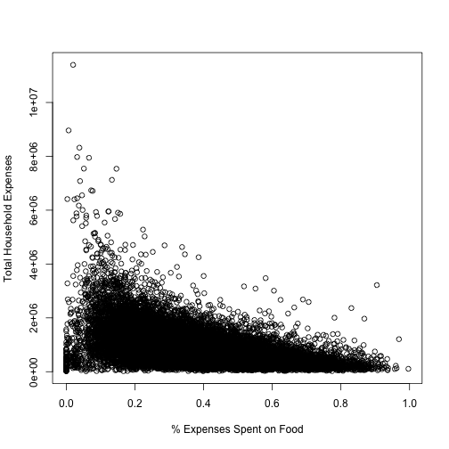

## Introduction to "BudgetFood Calculator"

Agenda
- What the Application Does
- How the Application Works
- Challenges Faced During Creation

--- .class #id

## What the Application Does

- Using the 'BudgetFood' dataset from the 'Ecdat' package
- Build a linear model to predict "wfood" (percentage of expenses spent on food)
- Allow application user to input their own values
- Allow user to "predict" their own "wfood" percentage

--- .class #id

## How the Application Works

Application consists of three files: ui.R, server.R, and helper.R
In the helper.R file, the data was loaded, and the model was built:


```r
model <- lm(wfood ~ totexp + age + size + town + sex, data = BudgetFood)
```

The model demonstrated good fit:

--- .class #id


```r
summary(model)
```

```
## 
## Call:
## lm(formula = wfood ~ totexp + age + size + town + sex, data = BudgetFood)
## 
## Residuals:
##      Min       1Q   Median       3Q      Max 
## -0.60931 -0.08809 -0.00964  0.07991  1.17272 
## 
## Coefficients:
##               Estimate Std. Error t value Pr(>|t|)    
## (Intercept)  3.672e-01  5.164e-03  71.122  < 2e-16 ***
## totexp      -1.385e-07  1.529e-09 -90.602  < 2e-16 ***
## age          2.169e-03  6.284e-05  34.521  < 2e-16 ***
## size         2.191e-02  5.663e-04  38.694  < 2e-16 ***
## town        -1.804e-02  7.363e-04 -24.500  < 2e-16 ***
## sexwoman    -8.329e-03  2.688e-03  -3.098  0.00195 ** 
## ---
## Signif. codes:  0 '***' 0.001 '**' 0.01 '*' 0.05 '.' 0.1 ' ' 1
## 
## Residual standard error: 0.1337 on 23965 degrees of freedom
##   (1 observation deleted due to missingness)
## Multiple R-squared:  0.3489,	Adjusted R-squared:  0.3487 
## F-statistic:  2568 on 5 and 23965 DF,  p-value: < 2.2e-16
```

--- .class #id

## User Data Selection and Interaction

- As part of the application, several UI widgets were provided allowing the user
to input a set of values for the same variables built into the model. These controls
are displayed down the left column of the page.
- Changes to the widgets selected new values, which are displayed immediately to
the user in the main panel of the page.
- Under the row where the values are displayed is a button. This button is used
to run the 'predict' command, returning the predicted percentage of food spend
as a percentage.
- All the UI elements were defined in the ui.R file.

--- .class #id

## Calculation and Prediction

- The remainder of the application functionality, including calculations (specifically)
the 'predict' function were performed within the server.R file.
- The 'predict' command was initiated by the action button defined on the UI.
- The associated code looked like this:


```r
output$Xprediction <- renderPrint({
    input$predict
    isolate(percent(predict(model, newdata = data.frame(totexp = input$IscaledExp*200,
                                         age = input$Iage,
                                         size = input$Isize, 
                                         town = input$Itown, 
                                         sex = input$Igender,
                                         stringsAsFactors = TRUE))))
    })
```

--- .class #id

## Challenges and 'Solutions'

Making the currency relevant to our cultural environment
- The range of 'totexp' (total household expenses) was huge (~14,000 - ~11,000,000)
- The 'solution' was to scope the UI widget to a semi-reasonable range (10-10,000)
and the multiply the response by 200 before predicting the value.
- This 'hack' allowed the model to produce consistent values in a currency users
of the application could understand. The data was collected in Spain in 1980, so
the relative currency at the time was dramatically different.

--- .class #id 

## Challenge Part 2

Negative Predicted Values
- A direct scaling of the 'totexp' field proved tricky, resulting in predictions
of a negative percentage of expenses. The data ended up not being perfectly linear.
This can be seen to some extent in the plot on the following slide.
- The 'hack' described on the previous slide help normalize the currency values.
- The multiplier set to '200' helped mask the potential negative values from the
application.

--- .class #id


```r
plot(BudgetFood$wfood, BudgetFood$totexp,
     xlab = "% Expenses Spent on Food", ylab = "Total Household Expenses")
```

 

--- .class #id

## Conclusion

Thank you for viewing my presentation
- This presentation:
    - Described my Project
    - Explained how it worked
    - Discussed a couple challenges and how they were dealt with


